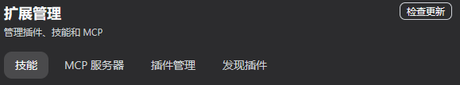
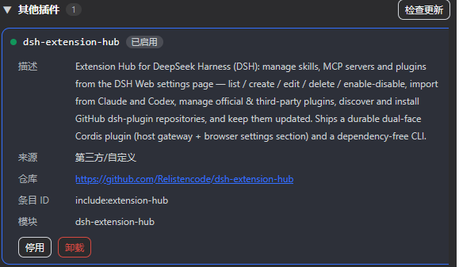
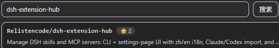

# dsh-extension-hub

> **v0.2.0 新功能** — 现在你可以更好地管理自己的插件了。Extension Hub 帮你管理**官方/第三方插件**，你可以视情况启用，并且能够在 DSH 里**直接安装开源的第三方插件**，以及**随时更新**它们！

一站式管理 DeepSeek Harness（DSH）的 Skills 与 MCP 服务器。

技能管理 · MCP 服务器 · 技能导入 · 插件管理

一个服务化的 DSH 扩展中心：零依赖的持久层与 CLI，加上嵌进 DSH Web 设置页的持久化管理界面——新建 / 编辑 / 启用 / 停用技能与 MCP 服务器、从 Claude Code 与 OpenAI Codex 一键导入，以及完整的插件管理器（官方/第三方分组、启用 / 停用 / 卸载、检查与更新，外加基于 GitHub 的插件发现与安装页）。

🌏 中文 · [English](README.md)

## 快速开始

**环境要求**：已装好 DSH（`dsh web` 能正常运行），Node.js ≥ 22，pnpm ≥ 10。

macOS / Linux（Windows 装了 Git Bash 或 WSL 也可）：

```bash
cd ~/.dsh/profiles/web
pnpm add dsh-extension-hub
grep -q "name: dsh-extension-hub" cordis.patch.yml || cat >> cordis.patch.yml <<'EOF'

- insert:
    - id: extension-hub
      name: dsh-extension-hub
EOF
```

Windows（PowerShell 5.1+ / pwsh）：

```powershell
cd "$env:USERPROFILE\.dsh\profiles\web"
pnpm add dsh-extension-hub
if (-not (Select-String -Path cordis.patch.yml -Pattern 'name: dsh-extension-hub' -Quiet)) {
  Add-Content -Path cordis.patch.yml -Value "`n- insert:`n    - id: extension-hub`n      name: dsh-extension-hub"
}
```

重启 `dsh web`，然后打开 **设置 → 扩展管理**。

安装一次即可，本插件可自动随版本更新。

## 主要功能

| 功能 | CLI | 设置页 UI |
|---|---|---|
| 列出技能 / MCP（含启用状态、范围） | ✅ | ✅ |
| 新建 / 编辑 / 删除技能 | ✅ | ✅（表单 + Markdown 正文） |
| 启用 / 禁用技能、MCP | ✅ | ✅ |
| 新建 / 编辑 / 删除 MCP（stdio / streamable-http） | ✅ | ✅ |
| 从 Claude / Codex 等其他工具导入技能与 MCP | ✅ | ✅ |
| 项目级安装（选择目标文件夹） | ✅（`folder` 命令） | ✅（DSH 目录选择器） |
| 插件管理（官方/其他分组，启用/停用/卸载） | — | ✅ |
| 发现并安装 GitHub `dsh-plugin` 仓库 | — | ✅ |
| 检查并更新第三方插件 | — | ✅ |

**内置技能只读**：列表会一并显示 DSH 部署自带的技能（shipped presets，如 `cordis` 预设自带的技能）与用户预设目录中的技能，标记为"内置/预设"且不可编辑/删除/切换 —— 它们属于 deployment 或预设层；如需覆盖，在用户或项目目录新建同名技能即可。

## 插件管理指南

**扩展管理**页自 v0.2.0 起内置完整插件管理器，共五个页签：**技能 / MCP 服务器 / 插件管理 / 精选目录 / 发现插件**。



### 管理已安装的插件

**插件管理**页列出你 DSH 组合中的每一行插件，分成两个可折叠分组：

- **官方插件** — DeepSeek 官方出品的 `@deepseek-ai/*` 包（默认折叠）。可以停用但不能卸载；`cordis:include` 是组合配置加载器本身，标记为**核心**——不可停用或卸载。
- **其他插件** — 第三方与你自己安装的插件（比如本插件）。

点击插件查看详情：描述、来源、仓库链接、条目 ID 与模块名。详情里可以：

- **启用 / 停用** — 写入你的 profile `cordis.patch.yml`，重启 `dsh web` 后生效。停用前会警告：不清楚功能的插件可能带来未知的严重问题。
- **卸载**（仅非官方插件）— 从配置中移除该插件行，先警告、再二次确认"确认卸载？"。若插件是通过"发现插件"安装的，其本地克隆目录会一并删除。

**其他插件**分组标题右侧有 **检查更新**：npm 包对比 registry、本地 git 克隆对比远端 HEAD。可更新的插件会在状态标签左侧出现绿色 **可更新** 按钮——点击拉取新版本（npm tarball 或 `git pull`），或用 **全部更新** 一键更新所有可更新插件。



### 发现并安装新插件

两个页签帮你找插件：

- **精选目录**（v0.2.3 新增）— 社区精选目录（[awesome-dsh-plugin](https://awesome-dsh-plugin.com/plugins.json)，每日刷新），11 个分类、双语描述、星数与排序（精选/最热/最新）。带 npm 映射的条目**从 npm 安装**（registry tarball，秒级完成，并校验包指向所选仓库以防名称抢占）；没有 npm 映射的条目回退为 GitHub 克隆。本地 24 小时缓存让该页离线可用。
- **发现插件** — 搜索 GitHub 上打了 `dsh-plugin` 标签的仓库（可用关键字缩小范围）。每个结果展示星数，已安装的仓库会带"已安装"徽标。

点击条目进入详情页——描述、星数、分类（精选）、安装方式与仓库链接——然后点 **安装**。Extension Hub 会：

1. **优先走 npm registry**（插件发布到 npm 时）：下载 tarball 到 profile 的 `node_modules`，全程不依赖 pnpm（无需符号链接/权限），并注册 bundle 行。
2. 否则**浅克隆**仓库到 `~/.dsh/extension-hub/plugins/<仓库名>`，并校验它带有可用的 `package.json` 入口。
3. 在 profile `cordis.patch.yml` 注册插件（托管 insert 块）并自检写入。

重启 `dsh web` 后，插件出现在**其他插件**分组里，可以停用、卸载（同时删除克隆目录），并用 **检查更新** 保持最新（本地 git 克隆通过 `git pull` 更新）。



> 安装意味着运行第三方代码。请只安装你信任的仓库，并先看仓库自己的 README 安装说明——打了 `dsh-plugin` 标签的仓库也可能是技能、MCP 服务器，或需要自定义安装方式。

## 最近更新

<details>
<summary>最近更新（点击展开）</summary>

- **2026-08** — v0.2.3：**新增精选目录页签 + npm 安装路径** — 新的**精选目录**页签浏览社区目录（awesome-dsh-plugin，11 个分类、双语描述、精选/最热/最新排序、24 小时离线缓存）；带 npm 映射的插件改为从 npm registry 以 tarball 安装（无需 pnpm，带防抢注的仓库校验），GitHub 克隆作为回退；修复：补丁持久化语义——0.2.2 的平铺行写入对 patch 文件是错的（裸顶层 `- id:` 行会被当作 "override" 而静默失效；行必须包在 `- insert:` 里）。所有 patch 写入回退到托管 insert 块区域；profile patch 已重建为正确格式，重启后插件加载恢复正常。
- **2026-08** — v0.2.2：统一平铺行 patch 持久化（CLI 与 UI 写入同一 loader 兼容格式）；MCP 列表读取合并行（region 与平铺格式）；`@` 前缀名的标量引号修复；卸载会删除发现页安装的克隆目录。
- **2026-08** — v0.2.1：发现插件分页（"加载更多"，每页 30）、插件详情改为弹窗、真实的"已安装"标记（按配置行校验，而非仅看克隆目录）、安装写入自检、横向溢出修复。
- **2026-08** — v0.2.0：完整插件管理器——官方/第三方分组（按厂商 scope）、组合加载器核心保护、带确认的启用/停用/卸载、逐个插件检查与更新（npm registry + 本地 git 克隆，支持全部更新）、以及基于 GitHub 的**发现插件**页（一键克隆安装 `dsh-plugin` 仓库）。
- **2026-08** — v0.1.4：将 v0.1.3 更新说明同步进发布包（registry 同步发布）。
- **2026-08** — v0.1.3：新增严格 Typert 描述符（`./typert`），修复协议包重复加载布局下 `/api/extensionHub/*` 404 的问题；一键更新直接下载 npm tarball（不依赖 pnpm）。
- **2026-08** — 抬头新增"检查更新"按钮：对比本地版本与 npm registry 最新版。
- **2026-08** — 分区更名为 **扩展管理** 并加抬头（"管理插件、技能和 MCP"）；导入从独立页签并入技能 / MCP 服务器页。
- **2026-08** — 完整中英双语（83 个文案键）、项目级文件夹选择、内置技能只读层。
- 首个版本 — CLI + 持久化设置页 UI + 零依赖持久层。

</details>

## 工作原理

- 宿主侧 `lib/host.js` 是一个 `TypertRemoteService` 网关（wire 命名空间 `extensionHub`）；浏览器侧挂载自己的 Remote contribution，通过挂载后的命名空间服务调用。
- 浏览器包在 `package.json` 里声明 `dsh.client.platform: "web"`，DSH 的 client-modules 系统在启动时扫描并注入 boot manifest，通过 `/plugins/dsh-extension-hub/client.js` 路由动态服务 —— **无需重建 web bundle**。
- 所有真实读写都在宿主进程内完成（不受会话文件沙箱限制），与 CLI 共用同一套 `lib/` 代码。

## 数据来源（检索范围）

| 来源 | Skills | MCP |
|---|---|---|
| **Claude** | `<repo>/.claude/skills/*/SKILL.md`、`~/.claude/skills/*/SKILL.md` | `<repo>/.mcp.json`、`~/.claude.json`、`~/.claude/.claude.json` |
| **Codex** | `<repo>/.codex/skills/*/SKILL.md`、`~/.codex/skills/*/SKILL.md` | `~/.codex/config.toml`、`<repo>/.codex/config.toml` |

转换时：Claude/Codex 的 `stdio` 服务器 → DSH `transport: stdio`（`command`/`args`/`env`）；`http`/`sse` → `transport: streamable-http`（`url`/`headers`）。Skill 的 `name`/`description`/`whenToUse` 保留，`license`/`allowed-tools` 折入 `metadata`。

## 安装位置（DSH 持久化落点）

### Skills

- **项目级** `--scope project` → `<目标文件夹>/.dsh/skills/<name>/SKILL.md`
- **全局** `--scope global` → `~/.dsh/skills/<name>/SKILL.md`

启用/禁用通过改写 `SKILL.md` frontmatter 的 `disable-model-invocation` / `user-invocable` 实现；删除即移除文件。

### MCP

- **全局** → 在宿主补丁 `~/.dsh/profiles/<profile>/cordis.patch.yml` 的受管区域（`# >>> dsh-extension-hub` … `# <<< dsh-extension-hub`）追加/改写 `- insert: {id, name: '@deepseek-ai/dsh-mcp-client', config}` 行。
- **项目级** → 写清单 `<目标文件夹>/.dsh/mcp-servers.yaml`，并生成专用预设 `~/.dsh/.agent-presets/<slug>-mcp/agent.cordis.yml`（以 shipped `standard` 为基底）。在会话预设选择器里选该预设即可生效。

## 支持平台

DSH 本身支持 Windows、macOS 与 Linux；本插件无平台特殊性 —— CLI 在任意 Node.js 环境可用，设置页 UI 跟随 DSH Web 宿主。

## 已知限制

- YAML/TOML 解析器是自带的**子集**实现，覆盖 DSH composition 与 Codex `config.toml` 的实际形态；遇到未覆盖写法会跳过或报错，不会静默破坏文件。
- Skill 发现与 DSH `dsh-skill-filesystem` 一致：只识别 `<root>/<name>/SKILL.md` 与 `<root>/<name>.md`，`name` 必须 kebab-case。
- 项目级 MCP 依赖"生成预设 + 手动选预设"机制；本工具不会替你在会话间自动切换预设。
- 项目级 MCP 的启用/禁用开关作用于生成的预设（即"这个项目选了这个预设时是否加载该服务器"），清单文件始终保留全部记录。
- 全局 MCP 的删除/编辑只影响本管理器添加的行（受管区域内）；手写进 patch 的行不受影响。

## 许可证

MIT
